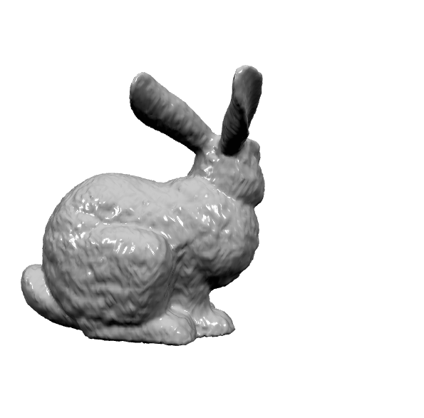

# Paper
* Youyi Zheng, Hongbo Fu, Oscar Kin-Chung Au, and Chiew-Lan Tai. 2011. <b>Bilateral Normal Filtering for Mesh Denoising</b>. IEEE Transactions on Visualization and Computer Graphics 17, 10 (October 2011), 1521-1530.      

## The Derivation Process
***Local Scheme***    
As a screenshot of the paper---**Bilateral Normal Filtering for Mesh Denoising**    
      
Now perform manual calculations to facilitate C++ implementation:      
}\zeta_{ij}W_c\left(\begin{Vmatrix}\mathbf{c}_i-\mathbf{c}_j\end{Vmatrix}\right)W_s\left(\begin{Vmatrix}\mathbf{n}_i-\mathbf{n}_j\end{Vmatrix}\right)\mathbf{n}_j&space;)

and     
}\zeta_{ij}W_c\left(\begin{Vmatrix}\mathbf{c}_i-\mathbf{c}_j\end{Vmatrix}\right)W_s\left(\begin{Vmatrix}\mathbf{n}_i-\mathbf{n}_j\end{Vmatrix}\right)})

=exp\left(\begin{Vmatrix}\mathbf{c}_i-\mathbf{c}_j\end{Vmatrix}\right)^2/2\sigma_c^2))   
=e^{-\frac{\begin{Vmatrix}\mathbf{c}_i-\mathbf{c}_j\end{Vmatrix}^2}{2\sigma_c^2}})   

=exp\left(\begin{Vmatrix}\mathbf{n}_i-\mathbf{n}_j\end{Vmatrix}\right)^2/2\sigma_s^2))  
=e^{-\frac{\begin{Vmatrix}\mathbf{n}_i-\mathbf{n}_j\end{Vmatrix}^2}{2\sigma_s^2}})  

$\mathbf{n}_i^\prime$ can be simplicified to                            
}\zeta_{ij}e^{-\frac{\begin{Vmatrix}\mathbf{n}_i-\mathbf{n}_j\end{Vmatrix}^2}{2\sigma_s^2}}e^{-\frac{\begin{Vmatrix}\mathbf{n}_i-\mathbf{n}_j\end{Vmatrix}^2}{2\sigma_s^2}}\mathbf{n}_j}{\sum_{j\in&space;N\left(i\right)}\zeta_{ij}e^{-\frac{\begin{Vmatrix}\mathbf{n}_i-\mathbf{n}_j\end{Vmatrix}^2}{2\sigma_s^2}}e^{-\frac{\begin{Vmatrix}\mathbf{n}_i-\mathbf{n}_j\end{Vmatrix}^2}{2\sigma_s^2}}})

The process is similar to:    

The related variables:        
$K_i$: The vector normalization coefficient

$N(i)$: the adjacent faces group of the $f_i$, it can be chosen be based on vertex/face

$c_i$: the centroid of the $f_i$

$c_j$: the centroid of the $f_j$

$n_i$: the normal of the $f_i$

$n_j$: the normal of the $f_j$

$W_c$: the Gaussian function based on centroid

$W_s$: the Gaussian function based on normal

$\sigma_c$: the standard deviation in the Gaussian function of centroid

$\sigma_s$: the standard deviation in the Gaussian function of normal

Through iteration, the paper suggests that performing the process 5 times is sufficient to determine the normal vector

***Global Scheme***      
As a screenshot of the paper    
  
To derive the aforementioned formula and compute the final result  
E_s&plus;\lambda&space;E_d=\underset{\mathbf{n}_i^\prime}{argmin}\left(1-\lambda\right)\begin{Vmatrix}\mathbf{n}_i^\prime-K_i\sum_{j\in&space;N\left(i\right)}w_{ij}\mathbf{n}_j^\prime\end{Vmatrix}^2&plus;\lambda\begin{Vmatrix}\mathbf{n}_i^\prime-\mathbf{n}_i\end{Vmatrix}^2&space;)   
and    
}w_{ij}\mathbf{n}_j^\prime\end{Vmatrix}^2)        
    

$\mathbf{n}_i^\prime$: the normal vector that needs to be determined
$\mathbf{n}_i$: the known normal vector of the face   
It is also known that    
}w_{ij}\mathbf{n}_j^\prime=\sum_{i\in&space;N\left(j\right)}w_{ji}\mathbf{n}_i^\prime)   
\begin{Vmatrix}\mathbf{n}_i^\prime-K_i\sum_{i\in&space;N\left(j\right)}w_{ji}\mathbf{n}_i^\prime\end{Vmatrix}^2&plus;\lambda\begin{Vmatrix}\mathbf{n}_i^\prime-\mathbf{n}_i\end{Vmatrix}^2&space;)   

-------------------------------------------------------------------
Based on the mathematical principle of least squares with a penalty term, by removing the ∑ symbol, the Result can be assembled into a matrix    
$$\Rightarrow Result = argmin_{N^\prime} (1 - \lambda) D (N^\prime - W N^\prime)^2 + \lambda D (N^\prime - N)^2$$    
Taking the partial derivative with respect to $N^\prime$ and setting it to zero, we have     
D\left(1-2W&plus;W^2\right)&plus;\lambda&space;D\left(2&space;N^\prime-2&space;N\right)=0)      

\left(1-W\right)^2&plus;\lambda\right]N^\prime=\lambda&space;N)           

and    
$N^\prime$: the unknown quantity to be determined, which is the normal vector     

$N$: the known normal vector of the face      

$W$: it is obtained by multiplying the Gaussian function based on central coordinates and the normal vector, and then assembled into a matrix using Eigen's setFromTriplets.      

By utilizing AX=B, X can be solved for. In principle, the result can be computed, and the relevant variables have already been provided by the Local Scheme, so they will not be reiterated here.   

## Compare the Local Scheme and Global Scheme
**origin bunny**

    

**the bunny after local scheme**

    

**the bunny after global scheme**

    

  <figure>
    
    <figcaption>Title 1</figcaption>
  </figure>
  <figure>
    
    <figcaption>Title 2</figcaption>
  </figure>
  <figure>
    
    <figcaption>Title 3</figcaption>
  </figure>

The local scheme is approximately 6 times faster than the global scheme. The primary time consumption in the global scheme lies in the matrix inversion process. In practical engineering applications, opting for the local scheme is the most optimal choice.

