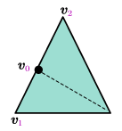
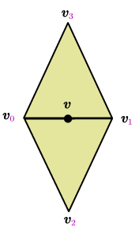
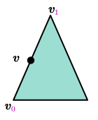
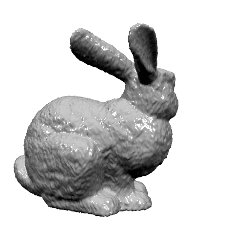
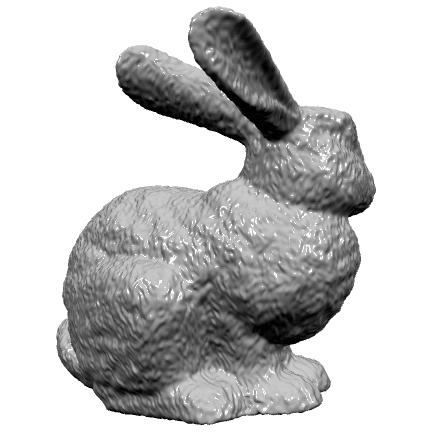

# 论文    
* Charles Loop: Smooth Subdivision Surfaces Based on Triangles, M.S. Mathematics thesis, University of Utah, 1987    
下载地址:https://www.microsoft.com/en-us/research/wp-content/uploads/2016/02/thesis-10.pdf     

根据论文规则,网格细分分为两步
1 增加三角形数量    
2 调整顶点位置    
预先设置更新后的mesh的顶点,半边,面,如下图所示    
    
一个三角形的顶点,半边,面的数量分别为3,6,1;在进行细分后,三者数量变为6,18,4     

调整顶点数量,有四种情况     
**更新原有顶点位置-顶点在内部**    
设原有内部顶点为 $v_{0}$ ,其相邻点为 $v_{1}$ , $v_{2}$ ,... $v_{n}$ ,则 $v_{0}$ 更新后位置变为  
v_{0}&plus;\beta\sum_{i=1}^{n}v_{i})      
本质是顶点本身和相邻顶点的加权和(有些类似与拉普拉斯去噪),它本身的权值是 $1-n\beta$ ,其邻接点的权值为 $\beta$ ,权值 $\beta$ 通过下式计算得到
\right)^{2}\right])    
     
😄 遍历的是顶点

**更新原有顶点位置-顶点在边界**    
设原有边界顶点 $v_{0}$ ,其两个相邻点为 $v_{1}$ , $v_{2}$ ,则 $v_{0}$ 更新后位置变为    
)   
    
😄 遍历的是顶点  

**更新边上的两个顶点--边在内部**         
设内部边的两个端点为 $v_{0}$ , $v_{1}$ , 相对的两个顶点为 $v_{2}$ , $v_{3}$ ,则新增加的顶点v位置为   
&plus;\frac{1}{8}\left(v_{2}&plus;v_{3}\right))   
      
😄 遍历的是边  

**更新边上的两个顶点--边在边界**    
设内部边的两个端点为 $v_{0}$ , $v_{1}$ ,则新增加的顶点v位置为     
)   
      
😄 遍历的是边  

### 比较Loop_Subdivision结果
<table>
  <tr>
    <td></td>
    <td></td>
  </tr>
  <tr>
    <td align="center">original</td>
    <td align="center">result</td>
  </tr>
</table>

